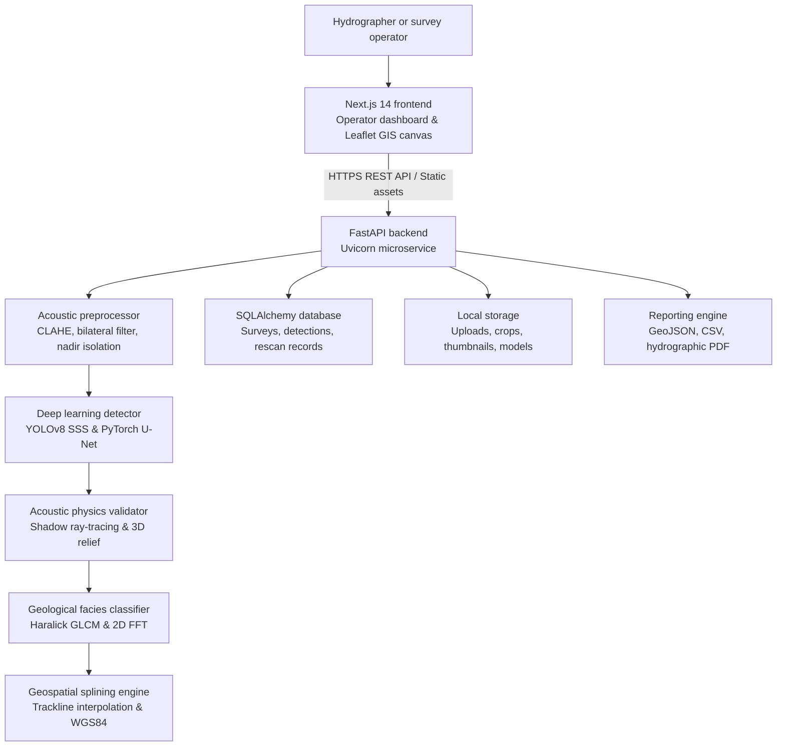

# VARUNA architecture

VARUNA is an automated deep-ocean acoustic intelligence platform engineered for SIH26057 under the auspices of the Ministry of Earth Sciences (MoES), Government of India. The web application combines a responsive Next.js 14 App Router client with Leaflet GIS mapping, an asynchronous FastAPI backend microservice, Ultralytics YOLOv8 and PyTorch U-Net neural pipelines, OpenCV and SciPy acoustic signal processors, and SQLAlchemy SQLite or PostgreSQL persistence.

## System context



## Component responsibilities

| Component | Responsibility |
|---|---|
| **Frontend** | Delivers the operator cockpit, interactive waterfall canvas, Leaflet GIS swath mapping, Explainable Sonar telemetry popups, Active Verification workflow, and analytics dashboard. Calls the backend API through a normalized client. |
| **FastAPI backend** | Handles survey file ingestion, background task orchestration, AI pipeline execution, database persistence, and hydrographic report generation. |
| **Acoustic preprocessor** | Applies slant-range gain equalization via CLAHE, bilateral speckle noise suppression, port/starboard nadir isolation, and overlapping 640x640 tile slicing. |
| **YOLOv8 SSS detector** | Executes anchor-free multi-scale neural object detection on tiled sonar waterfall patches across 4 primary debris and hazard classes. |
| **PyTorch U-Net segmenter** | Performs semantic contour segmentation on ALDFG ghost nets to extract polygon geometry and physical surface area ($m^2$). |
| **Acoustic physics validator** | Validates neural detections using directional shadow ray-tracing, calculates 3D protrusion height ($H = \frac{h \cdot L_s}{R_s + L_s}$), and penalizes unshadowed flat seabed clutter. |
| **Geological facies classifier** | Evaluates local seabed textures using Haralick GLCM matrices and 2D FFT spatial harmonics to reject sand ripples and boulder clutter. |
| **Geospatial splining engine** | Interpolates navigation ping records along survey tracklines and projects pixel bounding box offsets into WGS84 latitude and longitude coordinates. |
| **SQLAlchemy database** | Persists survey metadata, bounding box coordinates, confidence scores, acoustic telemetry, and active verification logs. |
| **Local storage** | Stores raw sonar waterfall uploads, extracted target thumbnails, forensic overlay crops, and neural network weight checkpoints. |
| **Reporting engine** | Compiles survey audit findings into structured GeoJSON, CSV, and formal hydrographic PDF dossiers. |

## Frontend

The frontend is a Next.js 14 App Router application written in TypeScript, React 18, and Tailwind CSS with a tactical dark sonar theme.

### Main routes

| Route | Purpose |
|---|---|
| `/` | Landing page providing system overview, architectural summaries, and quick navigation. |
| `/detection` | Primary acoustic inspection workspace: waterfall image viewer, multi-tile bounding boxes, Explainable Sonar modal, Active Verification adaptive rescan, and Leaflet GIS swath map. |
| `/cnn` | Acoustic Enhancement Lab: interactive CLAHE gain equalization and bilateral speckle noise filtering with side-by-side backscatter comparison. |
| `/watchlist` | Searchable marine debris registry: geolocation logs, bathymetric depths, ecological hazard ratings, and status auditing. |
| `/analytics` | Aggregate statistical dashboard: debris class distributions, confidence tier ratios, and survey audit metrics. |
| `/history` | Survey log repository displaying historical inspections, processing statuses, and report download triggers. |

### Client integration pattern

- Centralized API communication handles survey uploads, background polling, and detection retrieval.
- The interactive waterfall viewer renders bounding boxes directly on HTML5 canvas elements synchronized with zoom and pan controls.
- The Leaflet GIS swath viewer renders vessel tracklines, port/starboard swath boundaries, and georeferenced anomaly markers with popups linking directly to detection records.
- The Explainable Sonar panel displays real-time forensic overlays (cyan specular highlight, orange cast shadow, nadir vector) and mathematical confidence score formulas.
- Active Verification modals allow operators to plan secondary AUV survey tracks, simulate rescan passes, and commit human-in-the-loop audit decisions.

## Backend

The backend runs Python 3.11+ with FastAPI, Uvicorn, SQLAlchemy ORM, Pydantic v2, and PyTorch.

### API modules

| Route / Prefix | HTTP Method | Responsibility |
|---|---|---|
| `/health`, `/api/health` | GET | System health check, active model load confirmation, and checkpoint path verification. |
| `/api/surveys/upload` | POST | Ingestion of raw sonar waterfall images (PNG, TIFF, XTF, JSF) and optional navigation logs (CSV, JSON). |
| `/api/surveys/{id}/process` | POST | Asynchronous execution trigger for the full 4-stage computer vision and physics validation pipeline. |
| `/api/surveys` | GET | Paginated list of surveys with processing state, detection counts, and summary metrics. |
| `/api/surveys/{id}` | GET | Complete survey record including image paths, slant-range settings, and all associated detection objects. |
| `/api/surveys/{id}/annotated-image` | GET | Serves the generated waterfall image with color-coded bounding boxes and trackline overlays. |
| `/api/surveys/{id}/detections` | GET | Structured JSON array of detected anomalies with bounding box coordinates, confidence scores, and hazard tiers. |
| `/api/surveys/{id}/detections/{det_id}/explainability-image` | GET | Dynamically renders a cropped visual explainability image showing highlight, shadow, and nadir ray overlays. |
| `/api/surveys/{id}/detections/{det_id}/verify` | POST | Computes recommended secondary AUV rescan geometry (orthogonal heading $\pm 45^\circ$, CPA $15-35\,\text{m}$). |
| `/api/surveys/{id}/detections/{det_id}/verify/rescan` | POST | Executes secondary observation matching, compares evidence without artificial score boosting, and logs audit status. |
| `/api/surveys/{id}/report` | GET | Generates downloadable survey audit reports in JSON, CSV, or formal hydrographic PDF format. |
| `/api/surveys/{id}` | DELETE | Removes a survey record and deletes its uploaded assets, thumbnails, and generated crops from disk. |
| `/api/surveys/demo/create` | POST | Instantly instantiates a sample demonstration survey populated with held-out benchmark sonar imagery. |

### Execution and pipeline flow

```
[Upload / Ingestion]
        │
        ▼
[Stage 1: Preprocessing]
  ├── Bilateral speckle filter (sigma_color=35, sigma_space=9)
  ├── CLAHE slant-range normalization (clip_limit=3.0, tile_grid=(8, 8))
  ├── Port/starboard nadir isolation
  └── Overlapping 640x640 tile slicing (overlap=64px)
        │
        ▼
[Stage 2: Neural Detection]
  ├── YOLOv8 tiled inference (conf_threshold=0.15, iou_threshold=0.40)
  ├── Global coordinate re-projection
  ├── Cross-tile Non-Maximum Suppression (NMS)
  └── PyTorch U-Net semantic contour segmentation (ghost nets)
        │
        ▼
[Stage 3: Acoustic Physics Validation]
  ├── Directional shadow ray-tracing relative to nadir trackline
  ├── Specular highlight-to-shadow contrast ratio calculation
  ├── Morphological solidity and Hu moments scoring
  ├── 3D protrusion height calculation: H = (h * Ls) / (Rs + Ls)
  └── 0.48x confidence penalty multiplier for flat unshadowed clutter
        │
        ▼
[Stage 4: Geospatial Splining & Telemetry]
  ├── Linear spline interpolation across navigation GPS pings
  ├── Cross-track slant-range meter offset calculation
  ├── Physical dimension (length x width) estimation
  └── Ecological risk level classification
        │
        ▼
[Database Persistence & Report Generation]
```

## AI and acoustic processing pipeline

### Active production model taxonomy

The production detector ([`backend/models/yolov8_varuna_active.pt`](../backend/models/yolov8_varuna_active.pt)) is fine-tuned specifically for Side-Scan Sonar (SSS) waterfall logs across 4 verified classes:

| Class ID | Category Name | Acoustic Characteristics | Ecological & Operational Risk |
|---|---|---|---|
| `0` | `shipwreck` | High-contrast multi-structural specular highlights with extensive acoustic cast shadows. | High Navigational Hazard |
| `1` | `pipe_or_cylinder` | Linear specular reflections with parallel acoustic blockage shadows. | High Infrastructure Risk |
| `2` | `net_or_entangled_debris` | Diffuse, entangled acoustic backscatter webbing with complex non-geometric shadows (ALDFG). | Critical Ecological Hazard |
| `3` | `unknown_anomaly` | Unclassified acoustic anomalies flagged for human hydrographer review. | Operator Review Required |

An earlier 8-class model trained on Forward-Looking Sonar (FLS) is retained in the repository for research comparison but is not part of the active production pipeline due to fundamental sensor geometry differences. For complete benchmark metrics, see [docs/AI_BENCHMARK.md](AI_BENCHMARK.md).

### Physics-based acoustic shadow validation

In side-scan sonar hydrography, three-dimensional solid obstacles protruding above the seafloor obstruct acoustic beam propagation, casting an acoustic shadow (zero-backscatter zone) directly behind the object relative to the sonar towfish trajectory.

VARUNA implements a deterministic acoustic validation filter ([`backend/ai_pipeline/confidence_filter.py`](../backend/ai_pipeline/confidence_filter.py)):

$$\text{Confidence Score} = 0.50 \cdot \mathcal{S}_{\text{YOLO}} + 0.35 \cdot \mathcal{S}_{\text{Shadow}} + 0.15 \cdot \mathcal{S}_{\text{Morphology}}$$

Where:
- $\mathcal{S}_{\text{YOLO}} \in [0, 1]$: Raw bounding-box confidence score from the YOLOv8 detector.
- $\mathcal{S}_{\text{Shadow}} \in [0, 1]$: Normalized contrast ratio between the specular highlight and the acoustic cast shadow floor relative to the local background.
- $\mathcal{S}_{\text{Morphology}} \in [0, 1]$: Geometric solidity and aspect ratio score derived from contour analysis.

### Protrusion height estimation

For detected targets exhibiting a verified cast shadow, the target's physical vertical relief height ($H$) above the seabed is calculated from the towfish altitude ($h$), the measured acoustic shadow length ($L_s$), and the slant range to the highlight ($R_s$):

$$H = \frac{h \cdot L_s}{R_s + L_s}$$

### Clutter suppression rules

1. **Directional alignment:** Verifies that the cast shadow extends radially outward from the central nadir line along the acoustic propagation vector.
2. **Flat seabed clutter penalty:** Highlights lacking an acoustic shadow receive a `0.48x` multiplier, safely demoting planar geological clutter to the Low Confidence Tier ($<45\%$).
3. **Operational confidence tiers:**
   - **High Tier ($\ge 75\%$):** Neural detection validated by geometric cast shadow and directional alignment.
   - **Medium Tier ($45\% - 74\%$):** Candidate anomaly exhibiting partial shadow; triggers the Active Verification workflow.
   - **Low Tier ($< 45\%$):** Suppressed natural geological clutter or low detector confidence.

## Data model and persistence

The database layer utilizes SQLAlchemy ORM with SQLite for zero-configuration local execution, and is structured for PostgreSQL migration in production.

### Core entities

- **Survey (`surveys`):** Stores survey ID, title, original file path, processed image path, navigation metadata path, slant range setting, status (`uploaded`, `processing`, `completed`, `failed`), and timestamps.
- **Detection (`detections`):** Stores detection ID, associated survey ID, class name, class index, bounding box (`[x, y, w, h]`), raw detector score, shadow score, morphology score, composite confidence score, confidence tier, physical dimensions, GPS latitude/longitude, and thumbnail path.
- **Verification Plan & Result (`verification_plans`, `verification_results`):** Stores rescan waypoints, recommended observation heading, secondary detection association, evidence delta ($\Delta \text{Conf}$), and operator audit status (`confirmed`, `false_alarm`, `rov_escalated`).

### Storage layout

```
backend/
├── data/
│   ├── uploads/          # Raw uploaded SSS waterfall images and navigation files
│   ├── thumbnails/       # Cropped target thumbnails and visual explainability overlays
│   └── unified_sonar/    # Training and held-out validation dataset partitions
├── models/
│   ├── yolov8_varuna_active.pt   # Production active 4-class SSS detector
│   ├── unet_ghostnet.pt          # PyTorch U-Net ghost net segmentation model
│   └── yolov8_varuna.pt          # Legacy FLS 8-class research checkpoint
└── varuna.db             # Local SQLite database file
```

## Deployment and runtime environments

### Local development

- **Backend:** Python 3.11+ virtual environment running Uvicorn on `127.0.0.1:8000`.
- **Frontend:** Node.js 18+ development server running Next.js on `127.0.0.1:3000`.

### Containerized execution

Multi-container deployment via Docker Compose isolates the frontend Next.js server and backend FastAPI service on an internal bridge network:

```
[ Client Browser ]
        │
        ├── Port 3000 ──> [ Frontend Container (Node 20 Alpine) ]
        │
        └── Port 8000 ──> [ Backend Container (Python 3.11 Slim) ]
                                    │
                                    ├── Volume: ./backend/data/uploads
                                    └── Volume: ./backend/data/thumbnails
```

### Edge deployment readiness

The processing pipeline is architected for low-latency embedded compute (such as NVIDIA Jetson Orin Nano and Raspberry Pi 5). Tiled inference, OpenCV preprocessing, and deterministic ray-tracing operate with minimal memory overhead, supporting future direct integration inside AUV and USV payload canisters.
