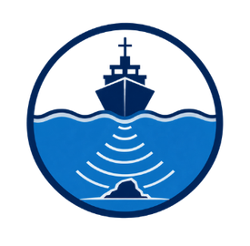

<div align="center">



# 🌊 VARUNA AI
### **AI-Powered Automated Underwater Marine Debris and Anomaly Detection System using Side-Scan Sonar Imagery**
#### **Smart India Hackathon (SIH 2026) — Problem Statement ID: SIH26057**

[-00F0FF?style=for-the-badge&logo=shield)](https://www.moes.gov.in/)
[](https://www.sih.gov.in/)
[](https://nextjs.org/)
[](https://fastapi.tiangolo.com/)
[](https://ultralytics.com/)
[](LICENSE)

</div>

---

## 📌 1. Problem Context & Background

The accumulation of anthropogenic (man-made) debris in marine and ocean ecosystems poses a catastrophic threat to global biodiversity. Among the most destructive pollutants are **"Ghost Nets"**—Abandoned, Lost, or Discarded Fishing Gear (**ALDFG**). These synthetic nets continuously trap and kill marine life (*"ghost fishing"*), smother fragile coral reef structures, and entangle commercial vessel and AUV propellers.

To map the seafloor, marine conservationists and underwater technologists deploy **Side-Scan Sonar (SSS)** instruments mounted on Autonomous Underwater Vehicles (AUVs), Remotely Operated Vehicles (ROVs), or towed survey sleds. 

### The Core Challenge
Manual human inspection of thousands of kilometers of acoustic waterfall imagery is:
- ⏳ **Extremely slow and labor-intensive** (taking weeks to process a single swath survey).
- ❌ **Prone to human fatigue and oversight** in low-visibility or highly reverberant waters.
- 🪨 **Hindered by natural seabed clutter** (sand ripples, mineral beds, rock clusters) that mimic artificial debris.

---

## 💡 2. The VARUNA AI Solution

**VARUNA AI** is an end-to-end, production-grade artificial intelligence software platform engineered specifically for **SIH26057** under the **Ministry of Earth Sciences (MoES), Government of India**. 

It enables operators to upload raw dual-channel side-scan sonar waterfall logs, pre-process them with acoustic noise reduction and CLAHE gain normalization, detect 8 categories of benthic debris using fine-tuned **YOLOv8 & U-Net models**, validate targets with **physics-based acoustic cast shadow verification**, and export structured GeoJSON/CSV/PDF audit reports with precise GPS coordinates.

---

## 🏛️ 3. Institutional Attribution & Contact Information

| Detail | Information |
| :--- | :--- |
| **Institution** | **Netaji Subhash Engineering College (NSEC), Kolkata** |
| **Location** | Techno City, Garia, Kolkata, West Bengal 700152, India |
| **Lead Developer** | **[BDutta18](https://github.com/BDutta18)** |
| **Email Address** | **[workwithbd18@gmail.com](mailto:workwithbd18@gmail.com)** |
| **Phone Number** | **`+91 8967722448`** |
| **Sponsoring Body** | **Ministry of Earth Sciences (MoES), Government of India** |
| **Problem Statement** | **SIH26057: AI-Powered Automated Underwater Marine Debris & Anomaly Detection** |

---

## 🧩 4. System Architecture & End-to-End Pipeline

```
                              [ Raw SSS Waterfall Sonar Stream / Files ]
                                                  │
                                                  ▼
                     ┌─────────────────────────────────────────────────────────┐
                     │          STAGE 1: Acoustic Preprocessing Lab           │
                     │  • CLAHE Slant-Range Gain & Contrast Equalization       │
                     │  • Adaptive Bilateral Speckle Noise Reduction           │
                     │  • Automatic Nadir Blind-Zone Isolation (Port/Stbd)     │
                     │  • Overlapping 640x640 Sonar Waterfall Patch Tiling     │
                     └────────────────────────────┬────────────────────────────┘
                                                  │
                                                  ▼
                     ┌─────────────────────────────────────────────────────────┐
                     │          STAGE 2: Deep Learning Neural Detector         │
                     │  • YOLOv8 Nano & Medium Sonar Inference                 │
                     │  • Semantic U-Net Contour Segmentation for Ghost Nets   │
                     │  • Multi-Tile Coordinate Reprojection & Cross-Tile NMS  │
                     └────────────────────────────┬────────────────────────────┘
                                                  │
                                                  ▼
                     ┌─────────────────────────────────────────────────────────┐
                     │     STAGE 3: Physics-Based Acoustic Shadow Validator    │
                     │  • Radial Offset Calculation along Sonar Beam Angle     │
                     │  • Highlight-to-Shadow Contrast Ratio Analysis          │
                     │  • Morphological Solidity & Hu Descriptors              │
                     │  • 0.48x Confidence Demotion for Flat Geological Clutter │
                     └────────────────────────────┬────────────────────────────┘
                                                  │
                                                  ▼
                     ┌─────────────────────────────────────────────────────────┐
                     │         STAGE 4: Geospatial Splining & Telemetry        │
                     │  • Navigation Ping Lat/Lon Linear Spline Interpolation  │
                     │  • Across-Track Slant-Range Meter Projection            │
                     │  • Physical Dimensions (Length x Width) Estimation      │
                     │  • Benthic Ecosystem Risk Level Classification          │
                     └────────────────────────────┬────────────────────────────┘
                                                  │
                               ┌──────────────────┴──────────────────┐
                               ▼                                     ▼
                  [ FastAPI Python Backend ]             [ Next.js 14 App Router UI ]
                • High-speed Async Processing           • Interactive Sonar Canvas Viewer
                • Edge ONNX & CUDA Inference            • Leaflet GIS Swath Map & Radars
                • Automated Inspection API              • Human-in-the-Loop Audit Center
```

---

## 🏷️ 5. Marine Debris & Anomaly Classification Taxonomy

VARUNA AI detects and classifies sonar echoes across **8 specialized categories**:

| Class ID | Class Name | Acoustic Characteristics | Ecological Threat Level |
| :---: | :--- | :--- | :---: |
| `0` | **Ghost Net (`ALDFG`)** | High acoustic backscatter with entangled, diffuse cast shadows | 🔴 Critical Hazard |
| `1` | **Fishing Gear & Lines** | Linear cordage, longlines, buoy ropes, anchor cables | 🟠 High Hazard |
| `2` | **Rubber Tires** | Circular highlight with central void acoustic shadow | 🟡 Medium Hazard |
| `3` | **Containers & Drums** | Rectangular hard specular edges with elongated geometric shadows | 🔴 Critical Hazard |
| `4` | **Metal Debris** | Strong acoustic reflectance with sharp high-contrast blockage | 🟠 High Hazard |
| `5` | **Shipwreck Fragments** | Multi-structural acoustic scatter and extensive shadow fields | 🟡 Moderate Hazard |
| `6` | **Rock Clusters** | Natural geological formations *(Shadow-verified to suppress false alarms)* | 🟢 Non-Hazardous |
| `7` | **Unknown Anomalies** | Unidentified acoustic targets flagged for human operator review | 🟡 Review Required |

---

## 🔬 6. Classical Physics-Based Acoustic Shadow Validation

In side-scan sonar physics, true three-dimensional objects protruding from the seafloor cast an **acoustic shadow** (a zone of zero backscatter) directly behind the object relative to the sonar transducer.

VARUNA AI computes a hybrid acoustic confidence score:

$$\text{Confidence} = 0.50 \cdot \mathcal{S}_{\text{YOLO}} + 0.35 \cdot \mathcal{S}_{\text{Shadow}} + 0.15 \cdot \mathcal{S}_{\text{Morphology}}$$

- **Directional Shadow Alignment:** Validates that the shadow is oriented radially outward from the central nadir track line.
- **Contrast Drop Ratio:** Verifies that the shadow region intensity drops significantly below the ambient background seafloor backscatter.
- **False-Positive Suppression:** If a detected highlight lacks a physical shadow (e.g., flat mineral deposits or seabed ripples), the confidence is **heavily suppressed ($\times 0.48$)**, demoting it to the **Low Tier ($<45\%$)**.
- **Tier Structure:**
  - 🟢 **High Tier ($\ge 75\%$):** Neural detection verified by geometric acoustic shadow.
  - 🟡 **Medium Tier ($45\% - 74\%$):** Potential anomaly requiring secondary survey or review.
  - 🔴 **Low Tier ($< 45\%$):** Suppressed geological clutter or low detector confidence.

---

## 💻 7. Tech Stack & Platform Components

- **Frontend Application:** Next.js 14 (App Router), React 18, TypeScript, Tailwind CSS (Sonar Dark Theme), Lucide Icons, Leaflet GIS, Recharts, Framer Motion.
- **Backend API & Microservices:** Python 3.11+, FastAPI, Uvicorn, SQLAlchemy ORM, SQLite/PostgreSQL, Pydantic v2.
- **AI & Vision Pipeline:** Ultralytics YOLOv8, PyTorch, Torchvision, ONNX Runtime, OpenCV, SciPy, NumPy, scikit-image.
- **Hardware Simulation & Telemetry:** NVIDIA Jetson Nano / Orin edge payload support, ESP32-CAM sonar stream simulator.

---

## 🚀 8. Quickstart & Installation

### Option 1: Local Development

#### 1. Clone the Repository
```bash
git clone https://github.com/rupamghosh2006/SIH26.git
cd SIH26
```

#### 2. Run Frontend
```bash
npm install
npm run dev
```
Open **[http://localhost:3000](http://localhost:3000)** in your browser.

#### 3. Run FastAPI Backend
```bash
pip install -r backend/requirements.txt
python -m uvicorn backend.app.main:app --host 127.0.0.1 --port 5000 --reload
```
Interactive API Documentation & Swagger: **[http://localhost:5000/docs](http://localhost:5000/docs)**.

---

### Option 2: Docker Deployment
```bash
docker-compose up --build
```

---

## 🗺️ 9. Application Modules

1. **Acoustic Sonar Enhancement Lab (`/cnn`)**: Interactive image/video enhancement with bilateral speckle filters, CLAHE, and quality metrics.
2. **Debris Detection Center (`/detection`)**: Multi-scale YOLOv8 object detection with bounding boxes, confidence tiers, and shadow length meters.
3. **GIS Operations Command Center (`/command-center`)**: Real-time Leaflet GIS swath mapping, GPS anomaly pins, and depth profiles.
4. **AUV Swath Mission Planner (`/mission-planner`)**: Autonomous swath path optimization, grid sweeps, and telemetry waypoint management.
5. **Ecological Risk & Drift Predictor (`/threat-prediction`)**: Hydrodynamic dispersion models and marine ecosystem risk indices.
6. **Telemetry & Acoustic Intercepts (`/comm-intercept`)**: Real-time hydrophone frequency audio spectrum and subsea telemetry logs.
7. **Audit & Report Export**: 1-click structured GeoJSON, CSV, and PDF export for maritime authorities.

---

## 🧪 10. Automated Testing

Execute the comprehensive Python test suite covering preprocessing, physics shadow verification, coordinate interpolation, and REST endpoints:

```bash
python -m pytest backend/tests
```

---

## 📬 11. Contact & Inquiries

For technical evaluations, research collaborations, or field deployments:

- **Institution:** Netaji Subhash Engineering College (NSEC), Kolkata
- **Lead Developer:** [BDutta18](https://github.com/BDutta18)
- **Email:** [workwithbd18@gmail.com](mailto:workwithbd18@gmail.com)
- **Phone:** `+91 8967722448`
- **Government Authority:** Ministry of Earth Sciences (MoES), New Delhi, India

---

<div align="center">
  <b>VARUNA AI</b> • Clean Oceans, Safe Benthic Ecosystems, Autonomous Intelligence
</div>

---

## 🚀 Quickstart Guide

### 1. Clone the Repository
```bash
git clone https://github.com/rupamghosh2006/SIH26.git
cd SIH26
```

### 2. Frontend Setup
```bash
# Install dependencies
npm install

# Start Next.js Development Server
npm run dev
```
Open **[http://localhost:3000](http://localhost:3000)** in your browser.

### 3. Backend Setup
```bash
# Install Python dependencies
pip install -r backend/requirements.txt

# Start FastAPI Inference Server
python -m uvicorn backend.app.main:app --host 127.0.0.1 --port 5000 --reload
```
API Documentation & Interactive Swagger UI: **[http://localhost:5000/docs](http://localhost:5000/docs)**.

---

## 📊 Core Application Modules

- **Acoustic Sonar Enhancement Lab (`/cnn`)**: Interactive image/video enhancement with CLAHE, bilateral speckle filters, and contrast metrics.
- **Debris Detection Center (`/detection`)**: Multi-scale YOLOv8 object detection with bounding boxes, confidence tiers, and shadow length meters.
- **GIS Operations & Swath Mapper (`/command-center`)**: Real-time Leaflet GIS mapping with AUV swath tracks, GPS anomaly pins, and depth profiles.
- **AUV Mission Planner (`/mission-planner`)**: Autonomous swath path optimization, grid sweeps, and telemetry waypoint management.
- **Ecological Threat & Drift Predictor (`/threat-prediction`)**: Oceanographic hydrodynamic dispersion models and marine ecosystem risk indices.
- **Export & Audit Reporting**: 1-click structured GeoJSON, CSV, and PDF export for maritime authorities.

---

## 📬 Contact & Support

For collaborations, technical inquiries, or institutional trials:

- **Institution:** Netaji Subhash Engineering College, Kolkata
- **Lead Developer:** [BDutta18](https://github.com/BDutta18)
- **Email:** [workwithbd18@gmail.com](mailto:workwithbd18@gmail.com)
- **Phone:** `+91 8967722448`
- **Sponsoring Body:** Ministry of Earth Sciences (MoES), Govt. of India

---

<div align="center">
  <b>VARUNA AI</b> • Built with ❤️ for Ocean Ecosystem Restoration & Sustainable Blue Economy
</div>
